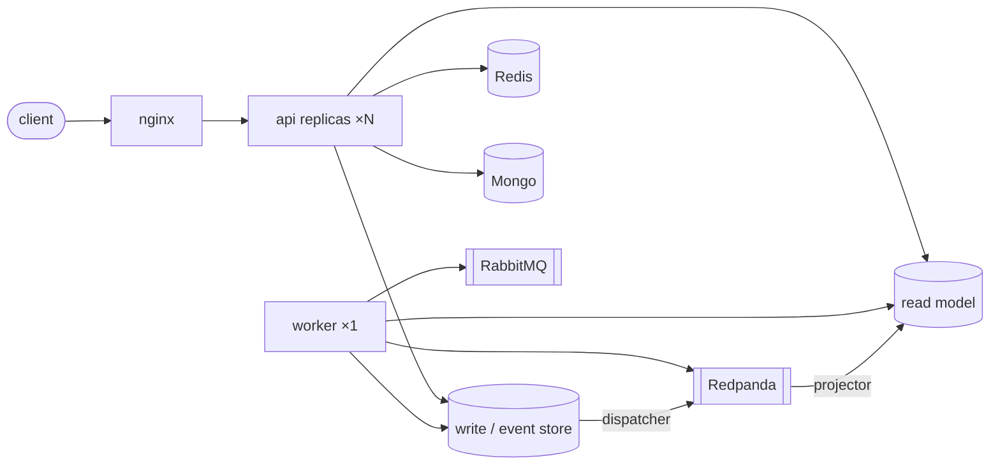

# Loan Management API (.NET 8)

A mini loan management API built around financial-services backend patterns: amortization schedules (reducing balance method), flat and effective (IRR) interest rates, late-payment fees, an event-sourced `Loan` aggregate with a validated state machine, CQRS with separate write/read databases synced over Redpanda, and real Stripe (Test Mode) payment integration with webhook signature verification and idempotent processing.

[](https://github.com/kasididpu/loan-project/actions/workflows/ci.yml)

> **Status: work in progress.** Built phase by phase; every phase lands as reviewed, tested commits. Nothing here is documented before it exists.

## Roadmap Progress

- [x] Phase 1 — Domain & core logic (amortization, interest, event-sourced `Loan` + state machine)
- [x] Phase 2 — Data layer (EF Core, event store, stored procedures, MongoDB)
- [x] Phase 3.5 — Secret management (Vault + `ISecretProvider`)
- [x] Phase 4 — Stripe payment integration (Test Mode)
- [x] Phase 5 — Async processing, event dispatcher, reconciliation/settlement
- [x] Phase 6 — CQRS write/read databases + reporting
- [x] Phase 7 — KYC/AML rules
- [x] Phase 8 — Auth, authorization & data protection
- [x] Phase 9 — High availability (API replicas, local compose)
- [x] Phase 10 — Performance & load testing
- [x] Phase 11 — DevOps, CI & observability
- [x] Phase 12 — Documentation (architecture, ADRs, migration path, AI workflow)

## Tech Stack

| Area | Choice |
|---|---|
| API | .NET 8 Web API, Clean Architecture |
| Relational DB | SQL Server (Docker); schema kept Azure SQL Database–compatible |
| Event sourcing | Append-only event store + snapshots, `Loan` aggregate only |
| Event streaming | Redpanda (Kafka-compatible) — CQRS sync |
| Messaging | RabbitMQ — async tasks |
| Cache | Redis |
| Audit log | MongoDB |
| Payments | Stripe (Test Mode) — webhooks, signature verification, idempotency |
| Secrets | HashiCorp Vault behind an `ISecretProvider` interface |
| Observability | Serilog → Seq |
| Testing | xUnit + Moq; k6 for load testing |
| CI | GitHub Actions (build, full test suite, HA smoke, secret scan) |

## Environment

**Local-first by design.** The entire system runs on one machine with Docker Desktop — that is the deliverable, and anyone who clones the repo gets the same experience. The relational schema is kept Azure SQL Database–compatible, so a cloud deployment path remains open as an optional final step.

## Architecture & documentation

Clean Architecture (Domain / Application / Infrastructure / Api), CQRS with
separate write/read databases, and a scoped event-sourced `Loan` aggregate — all
running on `docker compose`.



Full design docs live in **[`docs/`](docs/)**:

- [Architecture](docs/architecture.md) — layers, system, and the CQRS + event flow (diagrams)
- ADRs — [Event sourcing (scoped)](docs/adr/0001-event-sourcing-scoped.md) · [CQRS split](docs/adr/0002-cqrs-read-write-split.md) · [Secret management](docs/adr/0003-secret-management.md) · [High availability](docs/adr/0004-high-availability.md)
- [Production migration path](docs/production-migration.md) (local → Azure)
- [AI workflow](docs/ai-workflow.md) — how this was built with an AI agent, and one example where it got it wrong

## Run It Locally

Requires Docker Desktop and the .NET 8 SDK (or newer — the solution is a classic `.sln`).

```bash
git clone <this repo> && cd loan-project
docker compose up -d --wait   # SQL Server 2022 + MongoDB 8 + Vault + Redpanda + RabbitMQ + Redis (waits until healthy)
sh scripts/seed-vault-dev.sh   # put the local dev secrets into Vault (idempotent)

dotnet test               # unit + integration tests; the schema is migrated on first use
dotnet run --project src/LoanProject.Api   # dev boot migrates + seeds sample data, Swagger at /swagger
```

Both databases are migrated automatically — the app on dev boot, the tests on
first use — so no manual `dotnet ef database update` step is needed to clone and run.

The dev seed creates two customers and one event-sourced loan with real
history in the ledger (originated → approved → disbursed → first
installment paid), so both worlds have data to explore immediately.

**Explore it without a frontend:** open **Swagger** at `/swagger` and fire any
endpoint from the browser; watch structured logs in **Seq** at
`http://localhost:5341`; or import the portable **[Bruno collection](bruno/)** and
run the whole flow (login → originate → approve → disburse → status → event audit
trail → report). `GET /loans/{id}/events` returns a loan's full append-only history.

The target end state, kept as a hard requirement throughout: `docker
compose up` starts every backing service (Redis, RabbitMQ, Redpanda, Seq
and Vault join in their phases), and no Azure account or paid service is
ever required to run locally — Stripe integration uses Test Mode, which
is free to set up.

## Async Pipeline (Phase 5)

The event store doubles as the outbox: an `EventDispatcher` background
service reads ledger rows past a persisted cursor, publishes them to the
Redpanda topic `loan-events` (key = aggregate id, so each loan's events
keep their order), and advances the cursor only after the broker
acknowledges. A crash or broker outage between those steps means
re-publish, never loss — delivery is at-least-once and consumers dedupe
by `(AggregateId, Version)`. Payment notifications ride RabbitMQ as a
classic work queue; interest-rate lookups sit behind a Redis cache-aside
decorator that degrades to the slow source when Redis is down.

### Reconciliation vs Settlement

Two scheduled Quartz jobs that are deliberately not the same job, with
separate logs and separate audit entries:

- **Reconciliation** (`ReconciliationJob`) compares two independent
  records of the same money — our `Payment` table against Stripe's event
  feed — and **flags** discrepancies to the audit log. It moves nothing
  and fixes nothing: a missing payment means a lost webhook delivery,
  and writing money records stays the webhook path's job alone.
- **Settlement** (`SettlementJob`) acts on our own totals — it
  aggregates the day's collections (via the end-of-day stored procedure)
  and **moves** the money to the settlement account, here simulated by
  the audit record of the transfer. No external comparison is involved.

In short: reconciliation is a *check* between two books; settlement is an
*action* on our own book. Both run inside the app on Quartz because the
optional cloud target (Azure SQL Database) has no SQL Agent.

## High Availability (Phase 9)

The API is stateless and scales horizontally, while every background singleton
runs in exactly one worker. The local HA stack proves this with three API
replicas and one worker behind an nginx load balancer — the *same* image in
different roles, chosen by `App:Role`:

```
                       ┌───────────────┐
   client  ─────────▶  │     nginx     │  :8080  (round-robin + passive health)
                       └───────┬───────┘
             ┌─────────────────┼─────────────────┐
        ┌────▼───┐        ┌────▼───┐        ┌────▼───┐         ┌───────────────┐
        │  api1  │        │  api2  │        │  api3  │         │    worker     │
        │  HTTP  │        │  HTTP  │        │  HTTP  │         │ dispatcher +  │
        │  only  │        │  only  │        │  only  │         │ projector +   │
        └────┬───┘        └────┬───┘        └────┬───┘         │ consumer +    │
             └─────────────────┼─────────────────┘             │ Quartz + EF   │
                               │                               │ migrate/seed  │
              shared infra (SQL ×2, Redis, Mongo,              └───────┬───────┘
              Redpanda, RabbitMQ, Vault, Seq)  ◀───────────────────────┘
```

**Why split the roles.** The event dispatcher advances one persisted cursor as
it publishes the ledger to Redpanda; a second dispatcher would race that cursor
and double-publish. The Quartz jobs settle the day's collections; a second
scheduler would settle twice. So `App:Role=api` serves HTTP with **no**
background work, `App:Role=worker` (exactly one instance) owns the dispatcher,
the projector, the payment consumer, the scheduler, and the dev DB
migration/seed. `App:Role=all` (the default for `dotnet run`) does both, so the
single-process dev experience is unchanged.

**Health probes.** `/health/live` is liveness — the process is up.
`/health/ready` is readiness — it verifies the write DB, read DB, Redis, Mongo,
and RabbitMQ, so the load balancer only routes to a replica that can actually
serve.

**Run the HA stack**

```bash
docker compose -f docker-compose.yml -f docker-compose.ha.yml up -d --build
sh scripts/seed-vault-docker.sh        # service-name secrets for the containers
curl http://localhost:8080/health/ready
```

**Failover test.** With traffic flowing through nginx on `:8080`, stop a replica
and watch requests keep succeeding on the survivors — nginx takes the dead one
out of rotation after one failed attempt, and the `X-Upstream-Addr` response
header shows which replica answered:

```bash
docker stop loan-api2      # kill a replica mid-traffic
# every request still returns 200; X-Upstream-Addr now shows only api1 / api3
docker start loan-api2     # it rejoins the rotation
```

Observed on 2026-08-16 — three replicas round-robin normally, and a stopped
replica drops out with zero failed requests:

```
# normal — round-robin across all three
X-Upstream-Addr: 172.19.0.10:8080
X-Upstream-Addr: 172.19.0.9:8080
X-Upstream-Addr: 172.19.0.12:8080

# after `docker stop loan-api2` — 8/8 requests still 200, only two replicas left
200 200 200 200 200 200 200 200
X-Upstream-Addr: 172.19.0.12:8080
X-Upstream-Addr: 172.19.0.9:8080
```

## Continuous Integration (Phase 11)

Every push runs [`.github/workflows/ci.yml`](.github/workflows/ci.yml) — three jobs, no deploy (this is a local-first showcase):

- **Build & full test suite** — brings the *whole* system up with `docker compose up -d --wait` (SQL Server, Redpanda, RabbitMQ, MongoDB, Redis, Vault), seeds the dev Vault, then runs all tests against it. The integration tests hit the compose services on `localhost`, exactly like a developer's machine — the same suite that must pass locally passes in CI. The test projects run sequentially so a fresh database is migrated once, not raced.
- **HA stack smoke test** — builds the image and starts the full replica + nginx topology (`docker-compose.ha.yml`), then checks `/health/ready` through the load balancer, so a broken image or broken HA wiring fails CI.
- **Secret scan** — `gitleaks` over the full history (the repo will become public). The known non-secret dev defaults are allowlisted in [`.gitleaks.toml`](.gitleaks.toml); a real credential fails the job.

**Secret boundary.** No static secret lives in the workflow. Deploy-time credentials would come from GitHub Secrets (none needed here — there is no deploy); every *runtime* secret (Stripe key, connection strings) is read from Vault through `ISecretProvider` and is never present in CI.

## Observability

All services log through **Serilog** to **Seq** (`http://localhost:5341`) with structured events and request logging. A Customer's PII is masked by a destructuring policy before it ever reaches a sink, so a national id or bank account never lands in a log. Health is observable at `/health/live` and `/health/ready` (Phase 9).

## Conventions

Project conventions (architecture, code style, money-handling rules, commit format) are in [`CLAUDE.md`](CLAUDE.md). Agent tool permissions used during development are in [`.claude/settings.json`](.claude/settings.json).
