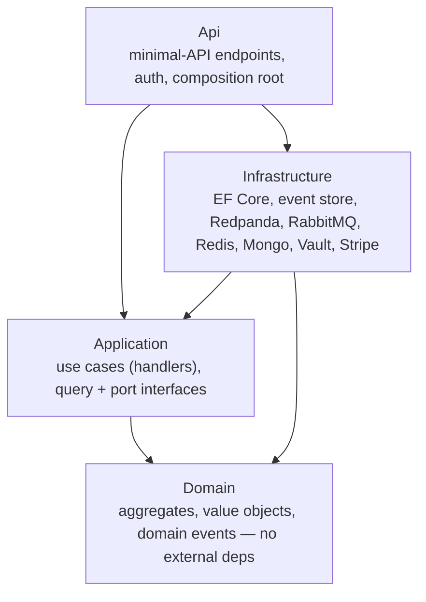
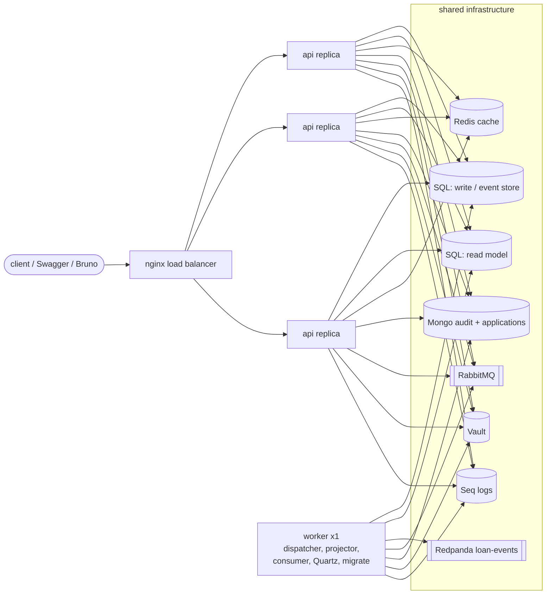
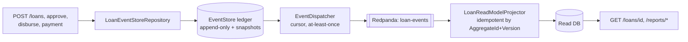

# Architecture

A mini loan-management API built to show financial-services backend patterns, run
**entirely on one machine** through `docker compose`. Clean Architecture with a
strict dependency rule (everything points inward; `Domain` has no external
dependencies), CQRS with separate write/read databases, and a scoped event-sourced
`Loan` aggregate.

## Layers

- **Domain** — business rules live here (amortization, the `Loan` state machine, money as `decimal`). No I/O.
- **Application** — one class per use case; depends only on `Domain` and on **interfaces** (`ILoanRepository`, `ISecretProvider`, `IPaymentGateway`, query interfaces). No infrastructure types leak in.
- **Infrastructure** — one folder per external technology; implements the Application's interfaces.
- **Api** — minimal-API endpoint groups (`MapXxx`) + auth; `Program.cs` is a composition root only.

## System (local-first)

Everything below runs from `docker compose`. The relational schema is kept Azure
SQL Database–compatible so a cloud path stays open (see
[production-migration.md](production-migration.md)).

The API is stateless and scales horizontally; every background singleton runs in
exactly one **worker** (a duplicated event dispatcher would race its cursor; a
duplicated scheduler would settle twice). Same image, role chosen by `App:Role`.
See [adr/0004-high-availability.md](adr/0004-high-availability.md).

## CQRS + event flow

A command appends to the event store (the write side). The store doubles as an
outbox: a single dispatcher publishes new events to Redpanda, and a projector
folds them into the Read database. Reads never touch the write side.

Write and read are **eventually consistent** — a write and its read are not
guaranteed visible in the same instant. That trade-off buys a read side that can
be queried and scaled without contending with writes. See
[adr/0002-cqrs-read-write-split.md](adr/0002-cqrs-read-write-split.md).

## Components and why

| Component | Choice | Why |
|---|---|---|
| API | .NET 8 minimal APIs | lightweight endpoints; `Program.cs` stays a composition root |
| Write DB / event store | SQL Server (Azure SQL–compatible) | ACID ledger; hand-written SQL for the append-only store (no change tracker) |
| Read DB | separate SQL database | CQRS isolation; synced only by projected events, never a cross-database query |
| Event streaming | Redpanda (Kafka API) | ordered per-loan event delivery to the read side |
| Messaging | RabbitMQ | async payment notifications (work queue) |
| Cache | Redis | rate-sheet cache-aside; degrades to source when down |
| Audit log | MongoDB | flexible-schema audit + loan applications |
| Secrets | HashiCorp Vault behind `ISecretProvider` | no secret in code/appsettings; per-environment documents |
| Payments | Stripe (Test Mode) | webhook signature verification + idempotent processing |
| Observability | Serilog → Seq | structured logs; PII masked before it reaches a sink |
| Scheduling | Quartz.NET (in-app) | Azure SQL has no SQL Agent, so jobs run in the app |

## Documentation map

- [adr/0001-event-sourcing-scoped.md](adr/0001-event-sourcing-scoped.md) — why only `Loan` is event-sourced
- [adr/0002-cqrs-read-write-split.md](adr/0002-cqrs-read-write-split.md) — the write/read split
- [adr/0003-secret-management.md](adr/0003-secret-management.md) — Vault + `ISecretProvider`
- [adr/0004-high-availability.md](adr/0004-high-availability.md) — web/worker split
- [production-migration.md](production-migration.md) — local → Azure mapping
- [ai-workflow.md](ai-workflow.md) — how this was built with an AI agent, and its guardrails
